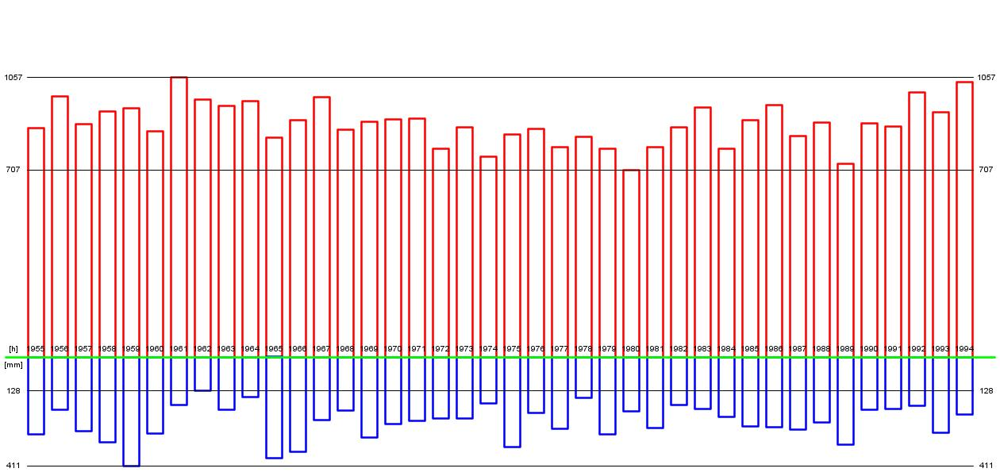

# Java-weather-data
A csv-file containing weather data gets visualized using Java with the help of the StdDraw class. The client can pick weather data between the years 1955 and 2020 and receive a visual representation of sun hours and rainfall in the Austrian capital Vienna within that time frame. The resulting graph gets stored as weather-graph.jpg as can be seen below

